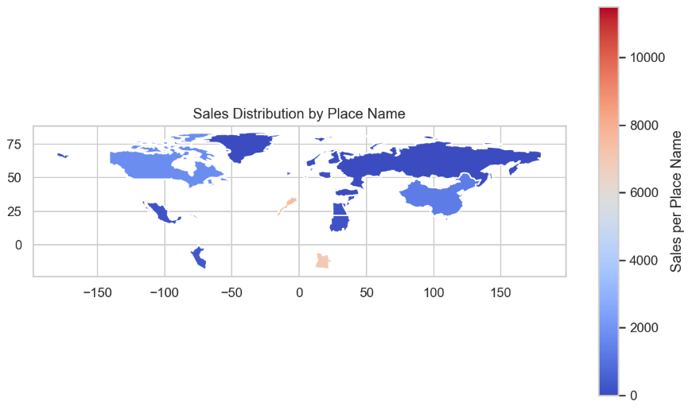
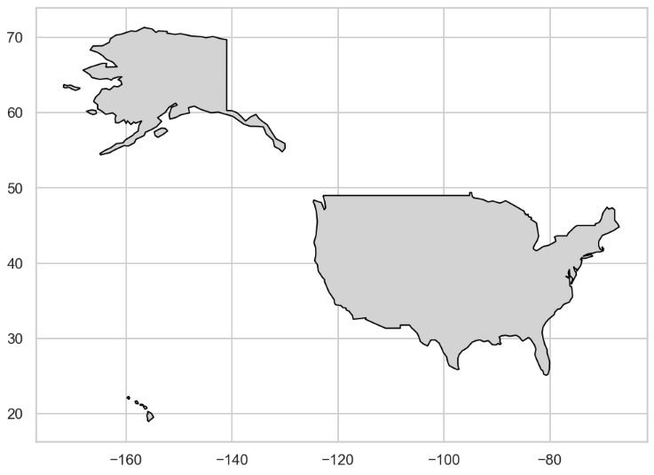

## Key Analysis  

1. **Sales Distribution by Place Name**  
   The Global Sales Distribution chart showcases the global distribution of sales by Place Name, with the intensity of the color gradient reflecting sales volume. Regions with higher sales are represented in red, while lower sales are shaded in blue.
   

2. **Plot the US Map**  
   The chart highlights the geographic scope of the United States, serving as a baseline for understanding sales distribution across regions.
   

---

## Tools Used  
- **Python**: Data analysis and preprocessing.  
- **Pandas**: Data manipulation and aggregation.  
- **Matplotlib & Seaborn**: Visualization of order trends.
- **Geopandas**:

---

## Conclusion  
-This visualization offers a comprehensive overview of the geographical spread of sales performance, allowing stakeholders to identify high-performing areas and potential markets for growth.
-The map serves as the foundation for evaluating location-specific sales metrics, enabling targeted decision-making for each state or region.

---

## Dataset & Source Code  
- **Dataset**: [Download Sales Data CSV](../../assets/data/sales.csv)  
- **Source Code**: [View on GitHub](https://github.com/hanif-dev/sales-analysis)
