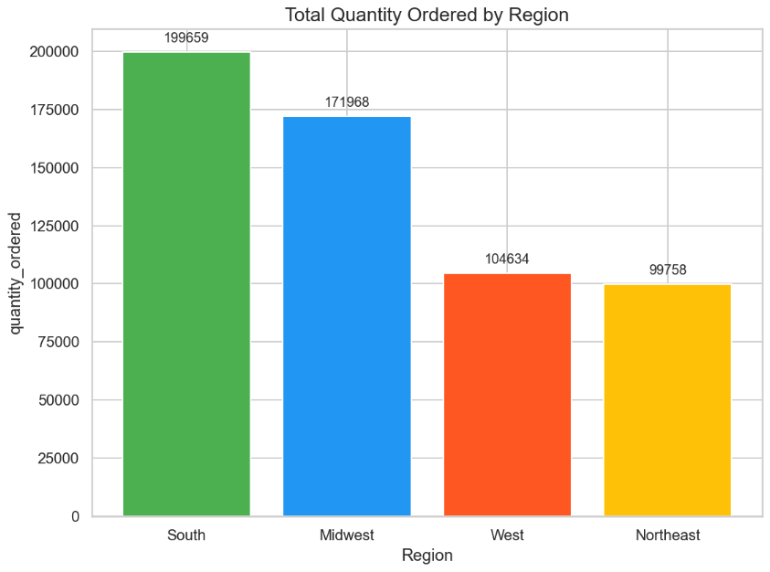

## Key Analysis  

1. **Total Quantity Ordered by Region**  
   Based on the regional analysis, the Southern region recorded the highest quantity ordered, reaching 199,659 units, followed by the Midwest with 171,968 units.

   

---

## Tools Used  
- **Python**: Data analysis and preprocessing.  
- **Pandas**: Data manipulation and aggregation.  
- **Matplotlib & Seaborn**: Visualization of sales trends.

---

## Conclusion
- This indicates that the Southern and Midwest regions are the primary drivers of product demand, and targeted strategies can be implemented in these areas to maximize growth opportunities.

---

## Dataset & Source Code  
- **Dataset**: [Download Sales Data CSV](../../assets/data/sales.csv)  
- **Source Code**: [View on GitHub](https://github.com/hanif-dev/sales-analysis)
